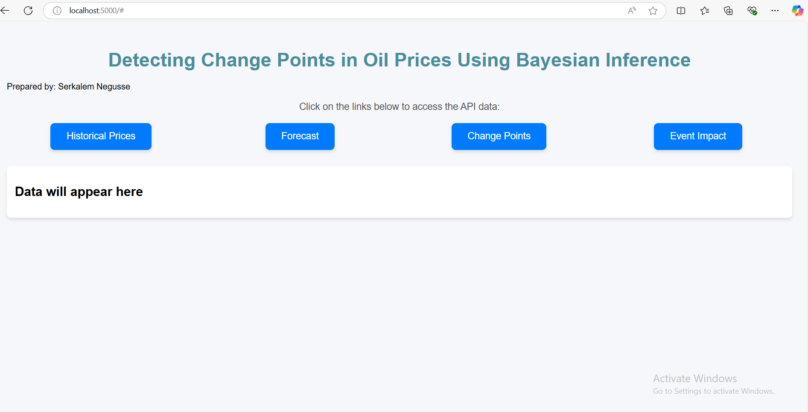
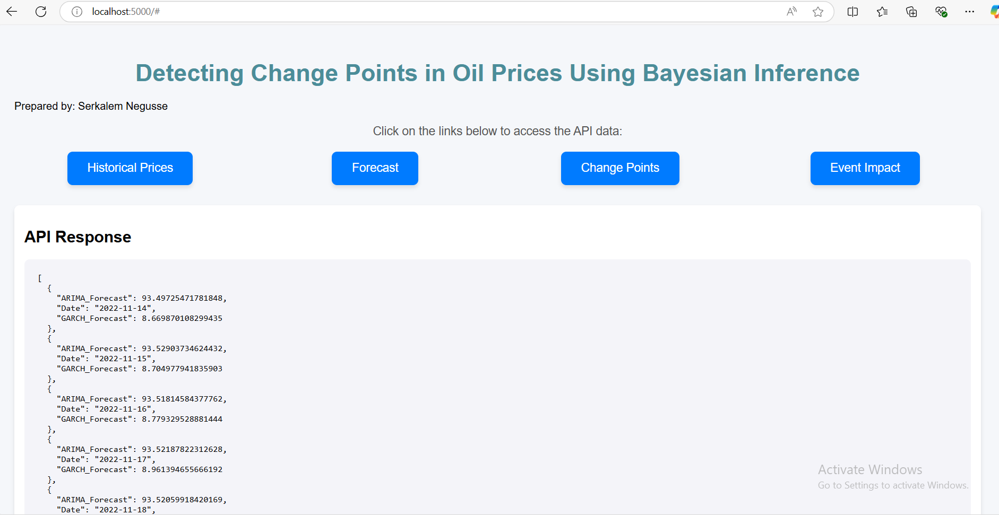

# Brent Oil Price Analysis: Change Point Detection & Forecasting

## 📌 Project Overview
This project analyzes historical Brent oil prices to detect significant market shifts and forecast future prices.  
It integrates **Change Point Detection**, **Time Series Modeling**, and **External Event Analysis**.

## 🔹 Features
✔ **Change Point Detection** (Bayesian CPD, CUSUM, PELT)  
✔ **Time Series Forecasting** (ARIMA, GARCH, Bayesian models)  
✔ **Impact of External Events** (OPEC policies, financial crises, conflicts)  
✔ **Interactive Dashboard** (Flask backend, React frontend)  

## 📊 Methodology
1. **Data Preprocessing:** Cleaning, missing value handling, formatting dates.  
2. **Exploratory Data Analysis (EDA):** Identifying trends, volatility, and seasonality.  
3. **Change Point Detection:** Identifying historical shifts in oil prices.  
4. **Time Series Forecasting:** Predicting future oil prices.  
5. **Event Impact Analysis:** Correlating major events with price movements.  
6. **Interactive Dashboard:** Visualizing key insights in a user-friendly web app.

## 🚀 Installation & Usage
### 1️⃣ Clone the Repository
```bash
git clone https://github.com/Serkalem-negusse1/BrentOilPrice-Analysis.git

cd BrentOilPrice-Analysis


